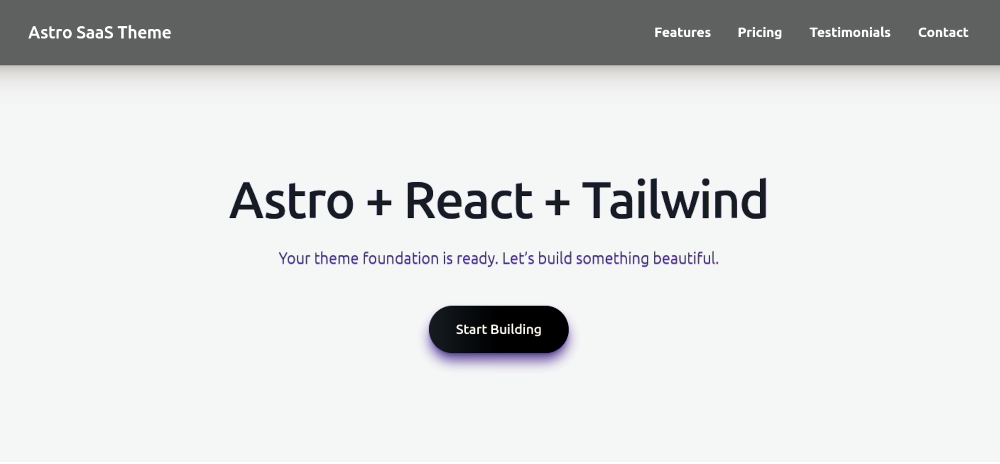

# SWIFT — Astro SaaS Theme

[](https://astro.build)
[](https://react.dev)
[](https://tailwindcss.com)
[](https://www.typescriptlang.org)
[](LICENSE)

**Author:** ENOON

A clean, modern starter theme built with **Astro**, **React Islands**, and **Tailwind CSS** for SaaS landing pages, product sites, and modern web apps.

## Demo
- Live demo: <https://example.com> *(optional)*

## Screenshots




## Features
- Ultra-fast performance with **Astro**
- **React islands** for interactive components where needed
- **Tailwind CSS** utility-first styling
- Sections included:
  - Hero
  - Features
  - Pricing
  - Testimonials
  - Contact form
  - Footer navigation
- Fully responsive
- Smooth micro-animations
- Minimal JavaScript

## Use this template

### Option A (recommended): create a new Astro project from this template
```bash
npm create astro@latest -- --template rpoc75/enoon
```

### Option B: use GitHub “Use this template”
1. Open: https://github.com/rpoc75/enoon
2. Click **Use this template** → **Create a new repository**
3. Clone your new repo and install dependencies:
```bash
npm install
npm run dev
```

### Update your site metadata
Common places to update:
- `astro.config.mjs` (often contains the `site` URL)
- `public/` (favicon / social images)
- Any config file you add (e.g. `src/config.ts`)

## Tech Stack
- **Astro**
- **React**
- **Tailwind CSS**
- **TypeScript**
- **Fonts:** Inter (body) + Lexend (headings)

## Getting Started

### Requirements
- Node.js 18+ (or 20+ recommended)
- npm / pnpm / yarn

### Installation
```bash
npm install
```

### Run locally
```bash
npm run dev
```

Then open:
- http://localhost:4321

### Build
```bash
npm run build
```

### Preview production build
```bash
npm run preview
```

## Customization

### Colors
All colors use Tailwind utility classes.
- Theme palette: `tailwind.config.mjs`

### Fonts
- Global styles / fonts: `src/styles/global.css`

## Contact Form
The contact form posts to:
- `POST /api/contact`

The default handler logs submissions to the server console (e.g. `console.log("New contact form submission:", data);`).

You can replace this with:
- Email service (Resend, SendGrid, etc.)
- Database write
- Third‑party API (Zapier, Make, etc.)

## License
MIT — see [LICENSE](LICENSE).

## Credits
Built by ENOON using Astro, React, and Tailwind.